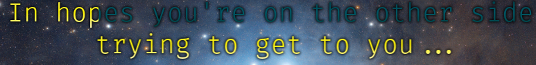

# OSD Lyrics

Show synced lyrics with your favorite media player on Linux.

## Introduction

OSD Lyrics is a desktop application to view lyrics compatible with various media players. It is not a plugin but a standalone program. OSD Lyrics shows lyrics on your desktop, in the style similar to KaraOK. It also provides another displaying style, in which lyrics scroll from bottom to top. OSD Lyrics can download lyrics from the network automatically.



## License

OSD Lyrics is released under GPL v3. See [LICENSE](LICENSE) for more detail.

## How to use

To use OSD Lyrics, just launch your media player, then launch OSD Lyrics.
OSD Lyrics will detect and connect to the media player.

## How to install

OSD Lyrics is available for Ubuntu, Debian, Fedora, OpenSUSE, FreeBSD and ArchLinux.
A list of packages' names, versions, and install instructions for each distribution is [available at pkgs.org](https://pkgs.org/search/?q=osdlyrics).

## Build instructions

### Requirements

* On Ubuntu, dependencies are listed on the [Ubuntu Universe page](https://packages.ubuntu.com/source/focal/osdlyrics).
* On Debian, dependencies are listed on the [Sid packages' page](https://packages.debian.org/sid/osdlyrics).
* On ArchLinux, dependencies are listed on the [AUR package](https://aur.archlinux.org/packages/osdlyrics-git).

## Cloning repository

You can use git to clone our repository with the latest changes, use the following command:

```
git clone https://github.com/osdlyrics/osdlyrics.git
```

## Building

After cloning the repository and installing dependencies, issue the following commands at the cloned directory to build and install:

```
./autogen.sh
./configure --prefix=/usr PYTHON=/usr/bin/python3
make
sudo make install
```

You can read more at [Building wiki page](https://github.com/osdlyrics/osdlyrics/wiki/Building).

## Troubleshooting

Check [Troubleshooting wiki page](https://github.com/osdlyrics/osdlyrics/wiki/Troubleshooting) for more detailed help.

## Contact us

The official source repository is on Github: https://github.com/osdlyrics/osdlyrics

If there is any feature request, suggestion, or bug, feel free to report them in [issues page](https://github.com/osdlyrics/osdlyrics/issues).

You can contact the developers for fast support through [our Discord server](https://discord.gg/vHC2Q3YUuA).

## How to contribute

We adopt [GitHub flow](https://guides.github.com/introduction/flow/index.html) for development, this means you can use GitHub issues, projects and pull requests pages to respectively submit bugs/suggestions, take a look at current roadmap/Kanban and submit changes.

You can read more at [Contributing wiki page](https://github.com/osdlyrics/osdlyrics/wiki/Contributing).

## Acknowledgements

Thanks to all the people who have directly or indirectly helped in the development of this project.
Special thanks to the original author "[Tiger Soldier](mailto:tigersoldi@gmail.com)", first contributors "[Sarlmol Apple](mailto:sarlmolapple@gmail.com)", "[Simply Zhao](mailto:simplyzhao@gmail.com)" and everybody else listed at [contributors page](https://github.com/osdlyrics/osdlyrics/graphs/contributors).
